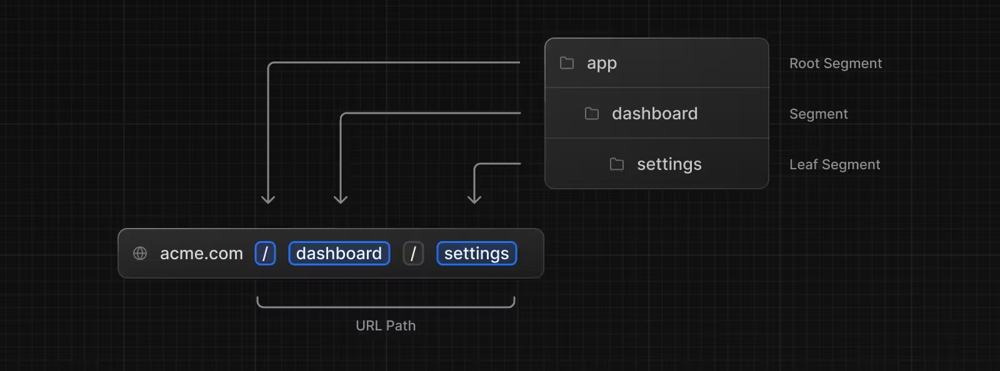

## Next.js가 필요한 이유

Next.js를 사용하면 React로 구성된 UI를 구현하고 라우팅, 데이터 페칭, 성능과 같은 요소를 해결함과 동시에 개발자 경험까지도 개선할 수 있다.

예를 들어 React로 서비스를 만들면 웹팩, 번들, 적절한 코드분할, SEO 처리 등 신경써야할 것이 많다. 반면에 Next.js는 적절한 추상화를 통해 개발자가 직접 고려해야할 사항들을 해결하며 아래와 같은 개발자 경험을 제공한다. 

- 직관적인 파일 시스템 기반 라우팅 시스템
- 페이지 단위의 사전 렌더링, 정적 생성, 서버사이드 렌더링
- 빠른 페이지 로딩을 위한 코드 분할
- 최적화된 프리페칭을 통한 클라이언트 사이드 라우팅
- 빠른 새로고침 지원
- 서버리스 함수로 API 엔드포인트를 구축할 수 있는 API 라우팅
- 완전한 확장성

## App Router

App Router는 보다 직관적인 디렉토리 구성으로 기존 리액트의 Page Router보다 더 간결해졌다. 또한 `**Suspense**`를 사용해 하이드레이션을 컴포넌트 단위로 사용할 수 있다. 이를  **`Streaming`** 이라고 한다. 쉽게 표현하면 데이터가 준비되는 만큼 미리 준비할 수 있게 되어 렌더링 시간을 줄일 수 있다. 

## 서버 컴포넌트

### 서버 컴포넌트가 필요한 이유

React는 서버에서 렌더링할 수 있는 컴포넌트인 RSC를 제공함으로써 개발자가 원하는 곳에서 컴포넌트를 렌더링할 수 있는 선택지를 제공한다. 

기존의 **`SSR`** 과 다른 점은 SSR은 서버에서 페이지 단위로 정적인 리소스를 생성하지만 RSC는 컴포넌트 단위로 정적인 리소스를 생성할 수 있다는 것이다. 

이 방식으로 클라이언트에 내려보내는 자바스크립트 번들의 크기를 줄이고 속도를 향상시킬 수 있다. 또한 데이터 조회에도 이점이 있다. 

### 서버 컴포넌트 OR 클라이언트 컴포넌트

브라우저 API를 사용하거나 **`useState, useEffect`** 같은 훅을 이용할 경우 클라이언트 컴포넌트만 사용해야 하는데 이때는 파일의 첫줄에 **`‘use client’`**라고 명시해야한다. 

```jsx
'use client'
 
import { useState } from 'react'
 
export default function Counter() {
  const [count, setCount] = useState(0)
 
  return (
    <div>
      <p>You clicked {count} times</p>
      <button onClick={() => setCount(count + 1)}>Click me</button>
    </div>
  )
}
```

### 서버 컴포넌트 활용패턴

훅과 이벤트 리스너도 사용 못하는 서버 컴포넌트를 사용하려면 클라이언트 컴포넌트를 최대한 하위 컴포넌트로 배치하길 권장한다. 클라이언트 컴포넌트를 최대한 하위 컴포넌트로 배치하면 서버컴포넌트에서 클라이언트 컴포넌트를 불러오는 동작은 문제가 없다는 것을 의미한다. 

- 아래의 코드는 동작하지 않은 예시

```jsx
'use client'
 
// 이 패턴은 동작하지 않습니다.
// 클라이언트 컴포넌트에서 서버 컴포넌트를 불러오기 할 수 없습니다.
import ExampleServerComponent from './example-server-component'
 
export default function ExampleClientComponent({
  children,
}: {
  children: React.ReactNode
}) {
  const [count, setCount] = useState(0)
 
  return (
    <>
      <button onClick={() => setCount(count + 1)}>{count}</button>
 
      <ExampleServerComponent />
    </>
  )
}
```

- 직접 불러오지 않고 자식 요소로 전달할 수 있음

```jsx
'use client'

import { useState } from 'react'
 
export default function ExampleClientComponent({
  children, // 서버 컴포넌트를 자식 요소로 전달할 수 있습니다.
}: {
  children: React.ReactNode
}) {
  const [count, setCount] = useState(0)
 
  return (
    <>
      <button onClick={() => setCount(count + 1)}>{count}</button>
 
      {children}
    </>
  )
}
```

### 서버 컴포넌트와 클라이언트 컴포넌트를 사용해야하는 경우

| 원하는 것 | 서버 컴포넌트 | 클라이언트 컴포넌트 |
| --- | --- | --- |
| 데이터 가져오기 | ✅ | X |
| 벡엔드 리소스에 직접 접근하기 | ✅ | X |
| 민감한 정보를 서버에 보관할 때 | ✅ | X |
| 자바스크립트 리소스 줄이기 | ✅ | X |
| 상호작용 이벤트 리스너(onClick, onChange) | X | ✅ |
| 상태 및 생애 주기 관리하기 | X | ✅ |
| 브라우저 API 사용 | X | ✅ |
| 리액트 클래스 컴포넌트 사용 | X | ✅ |

## 라우팅

웹 어플리케이션에서 경로란 URL Path를 말한다. Next.js에서는 파일 시스템 기반으로 경로를 지정한다. 

### 폴더 이름을 따른 URL Path

Next.js의 파일 시스템 기반의 라우팅은 아래와 같은 형태로 app이라는 폴더를 만들고 그 아래 dashboard, settings라는 폴더를 만들면 URL Path가 폴더 이름과 동일한 순서를 따라 만들어진다. 



Next.js에서 라우트를 표현하는 폴더인 경우에는 라우트 세그먼트라고 부른다. 

루트 세그먼트 이름을 app이라고 한다면 `App Router`, pages라고 한다면 `Pages Router`가 된다. 

### 상황에 따라 짓는 파일 이름

세그먼트에서는 파일이 필요한데 Next.js에서는 상황에 맞는 UI를 정의할 때 쓰는 파일 명이 이미 정해져 있다. 

- layout : 세그먼트의 메인 컨텐츠와 하위 세그먼트의 공용 레이아웃
- page : 세그먼트의 메인 컨텐츠
- loading : 세그먼트의 메인 컨텐츠와 하위 세그먼트의 로딩 UI
- not-found : 세그먼트의 메인컨텐츠와 하위 세그먼트의 Not Found UI
- error : 세그먼트의 메인 컨텐츠와 하위 세그먼트의 에러 UI
- global-error : 전역 에러 UI
- route : 서버 API 엔드포인트
- template : 특별하게 재사용될 수 있는 레이아웃
- default : 페러럴 라우트의 폴백 UI


위 이미지는 파일이름을 약속된대로 지정해서 세그먼트안에 정의한다면 Next.js가 알아서 React 컴포넌트를 배치해주며 언급한 파일명 이외에 아무 이름이나 넣어도 라우트에 영향을 주지 않는다. 또한 필요에 따라 추가할 수 있다. 

### 동적으로 변할 수 있는 URL Path 만들기(다이나믹 라우트)

블로그를 만든다면 게시글마다 ID혹은 이름을 갖게 된다. 블로그 상세페이지라면 `**/blog/:id`** 와 같은 형태를 가지고 있다. 이런 경우를 위해서 **`다이나믹 라우트`** 기능을 제공한다. 

다이나믹 라우트는 파일 이름을 대괄호로 묶어주는 걸 약속하며 대괄호 안에 지정한 이름을 Page 컴포넌트의 인자로 받을 수 있다.

```jsx
app/blog/[id]/page.jsx
export default function Page({ params }: { params: { id: string } }) {
  return <div>My Post: {params.id}</div>
}
```

## 페이지 간 이동

### `<Link>` 이용하기

`<Link>` 컴포넌트는 HTML `<a>`태그의 확장된 버전으로 페이지 이동 전에 필요한 데이터를 미리 페칭하는 프리페칭 기능을 지원한다.

```jsx
import Link from 'next/link'
 
export default function Page() {
  return <Link href="/dashboard">Dashboard</Link>
}
```

### **`useRouter()`** Hook 사용하기

`<a>` 태그를 사용하기 어려운 순간도 있는데 버튼 컴포넌트를 클릭해서 이동해야하는 경우이다. 이때는 useRouter를 사용하면 된다. **다만 useRouter는 클라이언트 컴포넌트에서만 사용할 수 있다.**

```jsx
**'use client'
 
import { useRouter } from 'next/navigation'
 
export default function Page() {
  const router = useRouter()
 
  return (
    <button type="button" onClick={() => router.push('/dashboard')}>
      Dashboard
    </button>
  )
}** 
```

## 데이터 페칭

### 서버에서 fetch

Next.js에서는 Web API에서 제공되는 fetch API의 확장된 버전을 제공한다. 덕분에 Next.js에서는 fetch로 각각의 패치 요청에 대한 캐싱, 재검증을 설정할 수 있다. 

fetch를 비동기 서버 컴포넌트나 라우트 핸들러에서 사용할 수 있다. 

```jsx
async function getData() {
  const res = await fetch('https://api.example.com/...')
  // 직렬화되지 않기 때문에 데이터 타입을 바로 사용할 수 있습니다.
 
  if (!res.ok) {
    // 에러를 던지면 가장 가까이 있는 error.tsx 파일에 걸립니다.
    throw new Error('Failed to fetch data')
  }
 
  return res.json()
}
 
export default async function Page() {
  const data = await getData()
 
  return <main></main>
}
```

클라이언트에서도 서버와 같은 방식으로 데이터를 패칭할 수 있지만 보안과 성능 이슈로 서버에서의 페칭을 권장한다. 

### 데이터 캐싱

기본적으로 fetch에 의해 발생한 요청은 자동으로 캐싱되며 여러번 요청해도 저장해둔 값을 불러오기 때문에 불필요한 API 호출을 막아준다. 캐시 데이터는 서버에 저장되어 빌드 타입 혹은 이후 요청에도 재사용이 가능하다. 

```jsx
// 'fetch-cache' 설정이 기본 값이다.
fetch('https://...', { cache: 'force-cache' })
```

사실 Next.js에서는 여러 단계를 거쳐 캐싱 동작이 수행된다. 데이터 캐시 뿐만 아니라 렌더링 단계에 있는  **`메모화(Memoization), 라우트 전체 캐시(Full Route Cache), 라우터 캐시(Router Cache)`** 가 존재한다. 


### 데이터 재검증

최신의 데이터를 원한다면 재검증을 통해 캐싱된 데이터를 무효화 시킬 수 있다. 캐싱된 데이터를 재검증 하는 방법에는 두가지가 있다. 

**`시간 기반 재검증`**

특정 시간이 지난 이후에 자동으로 재검증 되도록 설정할 수 있으며 시간이 지난 캐시데이터는 오래된 데이터로 판별될 뿐 삭제되지는 않는다. 재요청이 들어오면 다시 최신의 데이터를 불러온다. 이 것은 데이터가 자주 변경되지 않고 데이터의 시간이 중요하지 않은 경우에 유용하다. 

```jsx
// 3600초(60분) 동안 유효한 fetch
fetch('https://..', {next : {revalidate: 3600 } })
```


**`온디맨드 재검증(On-demand revalidtaion)`**

온디맨드 재검증은 태그 혹은 경로를 기반으로 특정 데이터 그룹을 수동으로 일괄적으로 재검증 하는 것을 말하며 이 때 재검증된 캐시 데이터는 삭제된다. 온디맨드 재검증은 즉각적으로 최신의 데이터를 확보해야할 때 유용하다. 

```jsx
// 데이터에 태그를 달아둔다.
fetch('https://...', { next: { tags: ['collection'] } })
// 태그된 데이터를 재검증한다. 
revalidateTag('collection')
```


## 메타데이터

Next.js에서는 메타 데이터를 설정하는 두가지 방법이 있다. 설정 기반 메타 데이터(config-based-Metadata)와 파일 기반 메타데이터(fire-based Matadata)가 그 방법이다. 

설정 기반 메타 데이터 방식에는 **`정적 방식`**과 **`동적 방식`**이 있다. 

### 정적 메타데이터

정적 방식은 메타데이터 객체를 정의하는 방식이다. 

```tsx
import type { Metadata } from 'next'
 
export const metadata: Metadata = {
  title: '...',
  description: '...',
}
 
export default function Page() {}
```

### 동적 메타데이터

방식은 `generateMetadata`라는 함수를 이용해 동적으로 Metadata 객체를 생성하는 방식이다.

```tsx
import type { Metadata, ResolvingMetadata } from 'next'
 
type Props = {
  params: { id: string }
  searchParams: { [key: string]: string | string[] | undefined }
}
 
export async function generateMetadata(
  { params, searchParams }: Props,
  parent?: ResolvingMetadata
): Promise<Metadata> {
  const id = params.id
  
  const post = await fetch(`https://.../${id}`).then((res) => res.json())
  
  const previousImages = (await parent).openGraph?.images || []
 
  return {
    title: post.title,
    openGraph: {
      images: ['/some-specific-page-image.jpg', ...previousImages],
    },
  }
}
 
export default function Page({ params, searchParams }: Props) {}
```