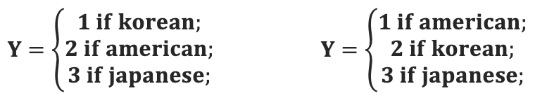
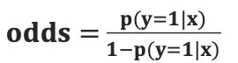
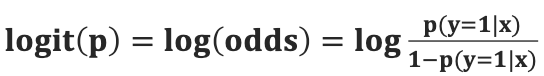

# 머신러닝
## Logistic Regression
### Why not Linear Resgression ?
* 선형 회귀를 통한 분류 
  * 
  * 일반적인 회귀에서는 라벨의 순서(크기)에 따라 결과가 달라짐
  * 다른 손실 함수나 모델이 필요함
### Logistic Regression
* 오즈(odds)
  * **성공(y=1) 확률이 실패(y=0) 확률에 비해 몇 배 더 높은가**를 나타냄
  * 

* 로짓 변환(logit)
  * 오즈에 로그를 취한 함수 형태
  * 입력값(p)의 범위가 [0,1]일때,[−∞,+∞]를 출력함
  * 
  
## Softmax Regression

## Support Vector Machine

## Decision Tree

## Linear Discriminant