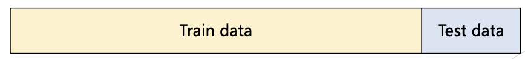
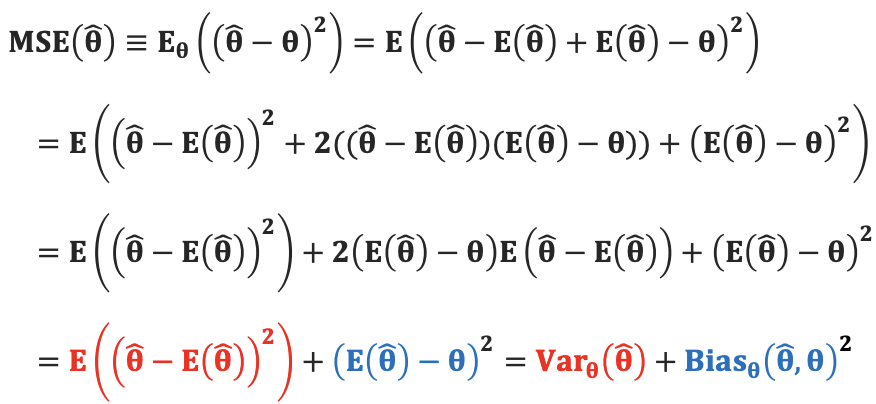

# 머신러닝
## Intro
### 머신러닝이란?
**머신러닝(machime Learning), 인공지능(Artificial Intelligence), 딥러닝(Deep Learning)** 이며 다음과 같은 관계를 가지고 있다.
$$인공지능 > 머신러닝 > 딥러닝$$

### 머신러닝 
* 단어 그대로 기계를 학습하는 것을 말한다.
* 머신 : 인간이 제공한 데이터를 표현할 수 있는 모델을 찾는 것(모델의 파라미터 최적화)
* 어떻게? **통계적인 방법** 혹은 **경사하강법**을 이용해 최적의 파라미터를 찾는다.

머신러닝은 **어떤 형태의 데이터**가 머신에게 주어지는지에 따라 학습방법이 다음의 세부 분야들로 분류가 된다. 
* 비지도 학습 : 정답이 있는 데이터를 학습시키는 방법으로 분류와 회귀가 있다.
* 지도 학습 : 정답이 없는 데이터를 군집화하여 새로운 데이터에 대한 결과를 예측하는 방법으로 클러스터링이 있다.
* 강화 학습 : 주어진 환경에서 어떤 행동을 취하고 이로부터 어떤 보상(reward)을 얻으면서 학습을 진행하는 방법이다.

### ML vs DL 
머신러닝과 딥러닝의 가장 큰 차이점은 **인공신경망의 유무**이다.
머신 러닝은 알고리즘을 사용하여 데이터를 구문 분석하고 해당 데이터에서 학습하며, 학습한 내용에 따라 정보에 근거한 결정을 내리는 반면에 딥 러닝은 알고리즘을 계층으로 구성하여 자체적으로 배우고 지능적인 결정을 내릴 수 있는 **'인공 신경망'** 을 만든다.

## Regression
### 회귀 VS 분류
* 회귀(Regression)
  - 입력값 : 연속값, 이산값 모두 가능
  - 출력값 : 연속값
  - 모델형태 : 일반적인 함수의 형태 $$ y = w_1x + w^0$$

* 분류(Classification)
  - 입력값 : 연속값, 이산값 모두 가능
  - 출력값 : 이산값
  - 모델형태 : 이진 분류라면 시그모이드 함수, 다중 분류라면 소프트맥스 함수를 꼭 포함해야 함

### Notations
* 데이터의 구성
  - 데이터는 피처(feature)와 라벨(label)로 구성됨
  - 이는 독립변수, 종속변수라고도 불림
  - 라벨은 y로 표기하며 라벨의 유무로 지도학습 비지도학습 구분

* Feature(=attribute, 피처)
  - 데이터 x의 특징, 혹은 항목을 의미
  - N: 데이터의 샘플 갯수, D: 피처의 갯수
  - ex) 혈압 몸무게, 나이 등

* Parameter (=weight, 파라미터, 가중치)
  $$ w_0, w_1, c\cdots w_n $$
  - 주어진 데이터 말고 모델이 가지고 있는 학습 가능한 파라미터 

* Hyperparparameter(하이퍼 파라미터)
  - 모델 학습에 있어 인간이 정해야 하는 변수들
  - 학습률, 배치 크기 등

* Input(입력값) vs Output(출력값)
  1. Input : 모델에 입력되는 값으로 데이터의 **피처** 부분 
  2. Output : 모델로부터 출력되는 예측값
  $$ x  \tag{1} $$ 
  $$ \hat{y} \tag{2}$$

* 선형모델 vs 비선형 모델
  - Linear regression (선형 회귀) : 파라미터를 선형 결합식으로 표현 가능한 모델
  $$ y = w_0, w_1x_1 + w_2x_2 + \dots + w_Dx_D, y = w_0 + w_1x + w_2x^2$$
  - Nonlinear regression (비선형 회귀) : 선형 결합식으로 표현 불가능한 모델
  $$log(y) = w_0 + w_1log(x), y = max(x,0)$$

### Basic Math for ML
* 함수
  - 두 집합 사이의 관계 혹은 규칙
  - $$y=f(x)$$
  - 이 때 x는 입력값, y는 출력값

* 일차 함수 
  - y가 x에 대한 일차식으로 표현된 경우
  - $$y = ax + b$$
  - a를 기울기, b는 절편이라고 표현

* 이차 함수 
  - y가 x에 대한 이차식으로 표현된 경우
  - $$y = a(x - p)^2 +q(a \neq 0)$$

* 순간 변화율
  - x값이 미세하게 변화했을 때 y의 변화율
  - $$f'(x) = \lim_{\Delta x \to 0} \frac{f(x + \Delta x) - f(x)}{\Delta x}$$
  - 어떤 x의 값(=a)에서의 그래프와 맞닿는 접선의 기울기

* 미분
  - 함수 f(x)를 미분한다는 것은 함수의 **순간변화율**을 구한다는 것
  - $$ f(x) 또는 \frac{d}{dx} f(x)$$

* 함수의 최솟값
  - 함수의 최솟값에서의 미분값(순간 변화율)은 항상 0임
  - 이를 바탕으로 파라미터의 최적값을 구할 수 있음

* 지수 함수
  - $$y= a^x(a \neq 1, a > 0)$$
  - a를 밑, x를 지수라고 함
  - 한 쪽은 0으로 수렴, 다른 쪽은 무한대로 발산

* 자연상수
  - $$e = \lim_{n \to \infty} \left(1 + \frac{1}{n}\right)^n$$
  - '자연 로그 밑' 또는 '오일러의 수'등으로 불림
  - 파이처럼 수학에서 중요하게 사용되는 무리수임
  - 100%의 성장률을 가지고 1회 연속 성장할 때 가질 수 있는 최대 성장량은 다음과 같음
  - $$\frac{d}{dx} e^x = e^x$$

* 시그모이드 함수(Sigmoid function)
  - **이진 분류** 문제를 위한 비선형 함수
  - $$f(x) = \frac{1}{1 + e^{-x}}$$
  - 함수의 출력값은 항상 0 이상 1 이하이며, 중앙출력값은 0.5임

* 소프트 맥스 함수(Softmax function)
  - **다중 분류** 문제를 위한 비선형 함수
  - $$ y_i = \frac{e^{z_i}}{\sum_{j=1}^{K} e^{z_j}}$$

* 로그함수
  - $$y =log_ax$$
  - 지수함수와 역함수의 관계
  - 로그함수의 밑이 e일 때, y = ln x

### 선형 회귀
* 단순 선형 회귀(simple linear regression)
  - 피처의 종류가 한 개인 데이터에 대한 회귀 모델
  - $$y=w_0 + w_1x$$

* 다중 선형 회귀(multiple linear regression)
  - 피처의 종류가 여러개인 데이터에 대한 회귀 모델
  - $$y=w_0, + w_1x_1 + \cdots + w_Dx_D$$

* 다항 회귀(polynomial regression)
  - 독립변수(피처)의 차수를 높인 회귀 모델
  - $$y=w_0 + w_1x + w_2x^2 + w_mx^m$$

### How to find optimal parametars? (최적의 파라미터는 어떻게 찾을까?)
Optimal(최적의)이란 데이터를 가장 잘표현한다는 말과 같은 뜻으로
  - 모델 **예측값과 실제값의 차이가 가장 적은** 모델
  - **손실 함수 값을 최소**로 만드는 모델 파라미터

## Optimization
### Advanced math for ML
* 편미분
  - 원하는 변수에 대해서만 미분하는 것
  - 그 외의 모든 것들은 상수 취급
  - $$\frac{\partial y}{\partial x}$$
  - $$f(x,y) = x^2 + xy + 3$$

* 연쇄 법칙(chain rule)
  - $$\frac{dy}{dx} = \frac{dy}{du} \cdot \frac{du}{dx}$$
  - $$y=ln(u), u = 2x + 4$$

### Loss function(손실함수)
* 평균 제곱 오차(mean squared error, MSE)
  - 회귀 문제에서의 대표적인 손실함수
  - 오차의 제곱의 평균
  - $$ L = \frac{1}{n} \sum_{i=1}^{n} (y_i - \hat{y}_i)^2$$

### Least Square Method
* 최소 제곱법(least square method)
  - 최적의 파라미터를 구할 수 있는 한 방법으로 **데이터에 대한 오차를 최소화**하도록 함
  - 기울기 a와 절편 b의 일차함수 공식은 다음과 같다.
  - $$L = \sum_{i=1}^N (y_i - (ax_i + b))^2$$
  - 풀이방법(1)
  - 정석적으로 풀이 
  - 풀이방법(2)
  - 행렬에 대한 편미분

### Gradient Descent 
* 복잡한 함수의 경우
  - 다중 선형 회귀, 다항 회귀, 비선형 함수
  - 최소 제곱법으로 해결이 어려움
  - 해결법은 **경사하강법**

* 경사하강법(gradient descent)
  - **손실 함수의 값을 최소화 시키는 방향**으로 파라미터를 업데이트
  - **함수의 최솟값은 무조건 순간변화율이 0**
  - **손실 함수에 대한 미분 값이 0**이되는 방향으로 파라미터의 업데이트 방향을 결정

* 슈도 코드(pseudo code)
  1. 현재 파라미터에서의 손실함수에 대한 미분값을 구함
  2. 미분값의 반대방향으로 파라미터 값을 업데이트
  3. 미분값이 0이 될 때까지 1~2번을 에폭(epoch)만큼 반복

* 학습률(learning rate)
  - 계산한 미분값을 그대로 사용해 업데이트 하지 않고 **학습률이 X인 미분값**을 사용
  - 학습률이 크면?
  - 학습률이 작으면?

* 학습률 스케줄러(learning rate scheduler)
  - 일반적으로 학습률을 큰 값에서 작은 값으로 변화시킴
  - Multi-Step scheduler
  - Cosine annealing scheduler

### Advaced Fradient Descent
* 확률적 경사 하강법(stochastic gradient descent)
  - 데이터가 매우 많을 때 전체 데이터 셋을 활용한 경사하강법은 계산 비용이 매우 큼 
  - $$W = (X^TX)^-1 X^TY$$
  - 1개의 데이터만 업데이트하고 이를 n번 반복

* 미니 배치 확률적 경사 하강법(mini batch stochastic gradient descent)
  - 둘의 절충안으로 배치(batch) 개념을 도입
  - 배치의 크기를 조절해서 학습 속도와 정확도를 조절함

## Bias & Variance

### Training data vs Test data
* 데이터의 분할
  - 입력된 데이터는 학습 데이터와 평가 데이터로 나뉠 수 있음
  - 학습 데이터는 모델 학습에 사용되는 모든 데이터셋
  - 평가 데이터는 오직 모델의 평가만을 위해 사용되는 데이터셋
  - **평가데이터는 절대로 모델 학습에 사용하면 안됨**

* 평가 데이터
  - 학습 데이터와 평가 데이는 같은 분포를 가지는가?
  - 평가 데이터는 어느 정도의 크기를 가져야하는가?
  

### Bias and Variance Trade-off
* 모델의 복잡도
  - 모델의 파라미터 수가 많아질수록(선형에서 비선형 모델로 갈수록), **복잡도**가 증가함
  - 모델이 복잡해질수록 학습데이터를 더 완벽하게 학습함
  - 학습과 평가 데이터의 분포가 같다는 가정하에 어떤 복잡도가 좋은가?
    - 학습데이터가 많은 상황(Under-fitting)
    - 학습 데이터가 적은 상황(Over-fitting, **과적합**)

* 편향과 분산
  - 편향과 분산은 알고리즘이 가지고 있는 에러의 종류
  
  