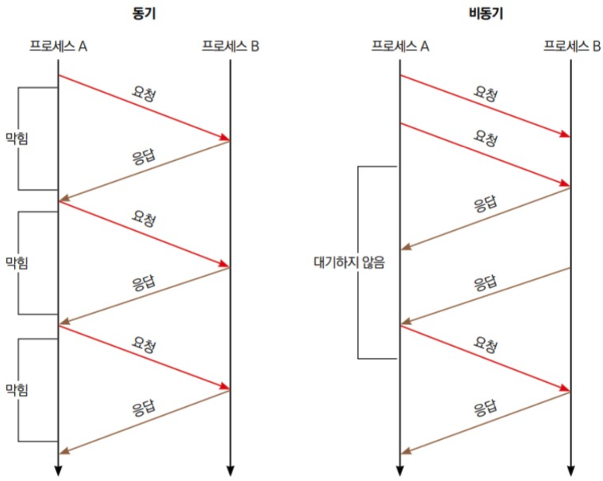
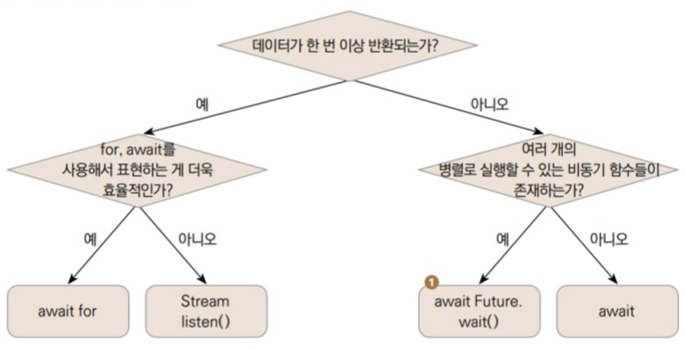

# 동기/비동기 프로그래밍

## 동기 VS 비동기
함수를 실행하면 다음 코드가 실행되기 전까지 해당 함수의 결과 값이 먼저반환되는 동기 프로그래밍과 달리 비동기 프로그래밍은 요청한 결과를 기다리지 않고 응답 순서 또한 요청한 순서와 다를 수 있게 프로그래밍할 수 있다. 그래서 컴퓨터 자원을 낭비하지 않고 효율적인 코드 실행이 가능하다. 예를 들어 DB에서 게시판 글을 가져오는 작업, 복잡한 미적분 계산, 이미지 인코딩 등 시간이 걸리는 작업을 동기로 실행한다면 앱이 매우 무거워질 수 있다. 그래서 이런 작업들은 비동기로 처리 해야한다.

**동기 방식과 비동기 방식의 요청과 응답**


### Future
Future 클래스는 미래라는 단어의 의미대로 미래에 받아올 값을 뜻한다. List, Set처럼 제네릭으로 어떤 미래의 값을 받아올지 정할 수 있다. 
```
Future<String> name;
Future<int> number;
Future<bool> isOpened; 

void main(){
  addNumber(1,1);
}

void addNumber(int number1, int number2){
  print('$number1 + $number2 계산 시작!');

  // Future.delayed를 사용하면 일정 시간 후에 콜백함수를 실행할 수 있다. 
  Future.delayed(Duration(seconds:3)(){
    print('$number1 + $number2 = ${number1 + number2}');
  });

  print('$number1 + $number2 코드 실행 끝');
}
 ```
```
Output
1 + 1 계산 시작!
1 + 1 코드 실행 끝
1 + 1 = 2
```
addNumber()는 print()를 실행하고 Future.delayed()를 통해 3초간 대기한다. 그 다음 마지막 print()를 실행하고 함수를 종료한다.

### async과 await 
async과 await를 사용하면 비동기 프로그래밍을 유지하면서도 코드 가독성을 유지할 수 있다. 
```
void main() {
  addNumber(1, 2);

  //async 키워드로 함수 매개변수 정의와 바디 사이에 입력함
  Future<void> addNumber(int number1, number2) async {
    print('$number1 + $number2 계산 시작!');

    // await는 대기하고 싶은 비동기 함수 앞에 입력
    await Future.delayed(Duration(seconds: 3), (){
      print('$number1 + $number2 = ${number1 + number2}');
    });
      print('$number1 + $number2 코드 실행 끝');
  }
}
```

```
Output
1 + 1 계산 시작!
1 + 1 = 2
1 + 1 코드 실행 끝
```

### 결과값 반환받기
async, await 키워드를 사용한 함수에서도 결과값을 받을 수 있다. 
```
void main(){
  final result = await addNumber(1, 1);
  print('결과값 $result');
  final result2 = await addNumber(2, 2);
  print('결과값 $result2');
}

Future<int> addNumber(int number1, int number2) async {
  print('$number1 + $number2 계산 시작!');

  await Future.delayed(Duration(seconds: 3){
    print('$number1 + $number2 = ${number1 + number2}');
  });
  print('$number1 + $number2 코드 실행 끝');

  return number1 + number2;
}
```
```
Output
1 + 1 계산 시작!
1 + 1 = 2
1 + 1 코드 실행 끝
결과값 2
2 + 2 계산 시작!
2 + 2 = 4
2 + 2 코드 실행 끝
결과값 4
```
위와 같이 await 키워드를 적용해도 일반 함수처럼 변수에 반환값을 저장하고 활용할 수 있다. 

### Stream
Future는 반환값을 딱 한 번 받아내는 비동기 프로그래밍에 적합하다. 반대로 지속적으로 값을 반환받아야할 때는 Stream을 사용한다. Stream은 한 번 리슨(Listen)하면 Stream에 주입되는 모든 값들을 지속적으로 받아온다. 


Future.wait()함수는 하나의 Future로 구성된 리스트를 매개변수로 입력 받는다. Future.wait()에 입력된 비동기 함수들은 모두 동시에 실행되며 응답값을 요청을 보낸 순서대로 저장해 둔다.**(주의: 호출한 순서대로 응답값을 받지는 않는다.)**

#### Stream 기본 사용법
스트림을 사용하려면 플러터에서 기본으로 제공하는 dart:async 패키지를 불러오고 StreamController를 listen()해야 값이 지속적으로 반환된다. 

```
import 'dart:async';

void main(){
  final controller = StreamController(); // 선언
  final stream = controller.stream; // stream 가져오기

  // Stream에서 listen 함수를 실행하면 값이 주입될 때마다 콜백 함수를 실행할 수 있다. 
  final streamListener1 = stream.listen((val){
    print(val);
  });

  // Stream에 값을 주입하기
  controller.sink.add(1);
  controller.sink.add(2);
  controller.sink.add(3);
  controller.sink.add(4);
}
```
```
Output
1
2
3
4
```

#### 브로드캐스트 스트림
Stream은 단 한 번만 listen을 실행할 수 있다. 하지만 하나의 스트림을 생성하고 여러 번 listen함수를 실행해야할 때도 있다. 이럴 때 브로드캐스트 스트림을 사용한다.
```
import 'dart:async';

void main(){
  final controller = StreamController();

  // 어러번 리슨할 수 있는 Broadcast Stream 객체 생성
  final stream = controller.stream.asBroadcastStream();

  // 첫 listen 함수
  final streamListener1 = = steam.listen((val){
    print('listening 1');
    print(val);
  });

  // 두번째 listen 함수
  final streamListener2 = = steam.listen((val){
    print('listening 2');
    print(val);
  });

  // add()를 실행할 때마다 listen()하는 모든 콜백 함수에 값이 주입됨
  controller.sink.add(1);
  controller.sink.add(2);
  controller.sink.add(3);
}
```
```
Output
listening 1
1
listening 1
1
listening 2
2
listening 2
2
listening 3
3
listening 3
3

```


#### 함수로 Stream 반환하기
StreamController를 직접 사용하지 않고도 직접 Stream을 반환하는 함수를 작성할 수도 있다. Future를 반환하는 함수는 async으로 함수를 선언하고 return 키워드로 값을 반환하면 된다. Stream을 반환하는 함수는 async*으로 함수를 선언하고 yield로 값을 반환하면 된다. 

```
import 'dart: async';

// Stream을 반환하는 함수는 async*로 선언
Stream<String> calculate(int number) async* {
  for(int i=0; i<5; i++){
    //StreamController의 add()처럼 yield 키워드를 이용해서 값 반환
    yield 'i = $i';
    await Future.delayed(Duration(seconds: 1));
  }
}

void playStream() {
  // StreamController와 마찬가지로 listen() 콜백함수 입력
  calculate(1).listen((val)=> {
    print(val);
  });
}

void main() {
  playStream();
}
```
```
Output
i = 0
i = 1
i = 2
i = 3
i = 4
```

## 핵심 요약
1. 비동기 프로그래밍을 이용하면 오랜 기간 CPU리소스가 막히는 상황을 방지할 수 있다. 
2. async 키워드를 사용해서 비동기 함수를 정의할 수 있다.
3. await 키워드를 사용하면 비동기 함수를 논리적 순서대로 실행할 수 있다. 
4. Future는 한 번만 비동기 응답을 받을 때 사용하는 클래스이다. 
5. Stream은 지속적으로 리슨해서 비동기 응답을 받을 때 사용하는 클래스이다.
  * 한 번 listen()하면 지속적으로 값을 받아볼 수 있다. 
  * async* 키워드로 정의한다. 
  * 값을 반환할 때 yield 키워드를 사용한다.
  * 함수에서 Stream을 반환할 수 있다. 