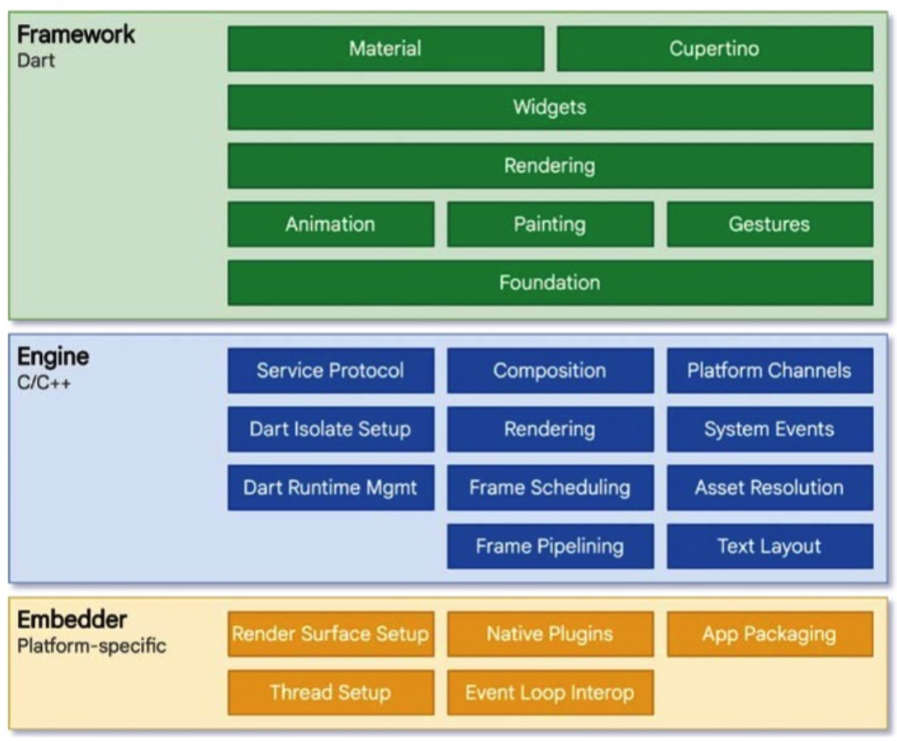
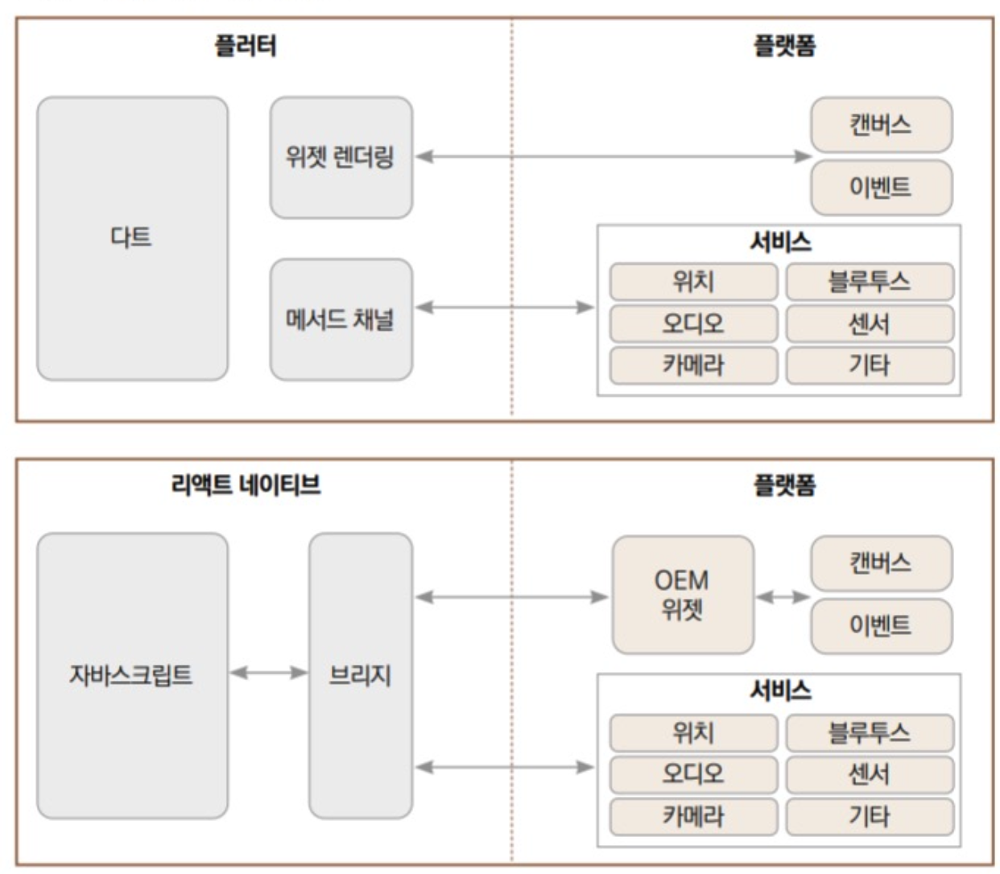

# 플러터 소개
플러터는 구글이 구현한 크로스 플랫폼 프레임워크이다. 초기에는 안드로이드와 IOS만 지원했지만 지금은 웹, 맥OS, 윈도우, 리눅스 데스크톱까지 지원하고 있다. 기존 리액트 네이티브가 장악한 크로스 플랫폼 앱 개발 프레임워크 시장에서 플러터가 점유율을 높이고 있다. 
 
플러터는 플랫폼 간 이질감이 적은 크로스 플랫폼 프레임워크이다. 기존 크로스 플랫폼 프레임워크들은 코드를 네이티비 프레임워크 코드로 전환하는데 중점을 두었다면 플러터는 스키아 엔진을 사용해 2D 렌더링 엔진과 직접 통신한다. 이 장점으로 플러터는 어떤 플랫폼에서도 일관된 UI를 제공한다. 

## 플러터 구조 살펴보기

플러터 프레임워크는 세 개의 계층으로 나눠져 있다. 하드웨어와 가장 가까운 로우레벨 계층인 '임베더 계층'은 플러터가 현재 지원하는 6개 플랫폼의 네이티브 플랫폼과 직접 통신을 하고 운영체제의 자체적 기능을 모듈화해둔 계층이다. 이 모듈들은 각 플랫폼의 네이티브 언어로 작성되어 있다. 중간 계층은 '엔진 계층'이며 C++로 작성되어 있고 플러터 코어 API와 스키아 그래픽 엔진 파일, 파일 시스템, 네트워크 등이 정의되어 있다. 마지막 계층으로 '프레임워크 계층'에는 플러터 프레임워크를 사용하는 위젯, 에니메이션, 머터리얼, 쿠퍼티노 패키지가 정의되어 있다. 
 
#### 플러터가 스키아 엔진을 사용하는 이유
플러터는 웹뷰를 사용하지 않고 직접 스키아 엔진을 사용해 화면에 UI를 그린다. 이 때 새로 렌더링이 필요한 위젯들만 렌더링하기 때문에 다른 크로스플랫폼보다 뛰어난 퍼포먼스가 가능하다.

**리액트와 플러터의 플랫폼 통신 구조**
