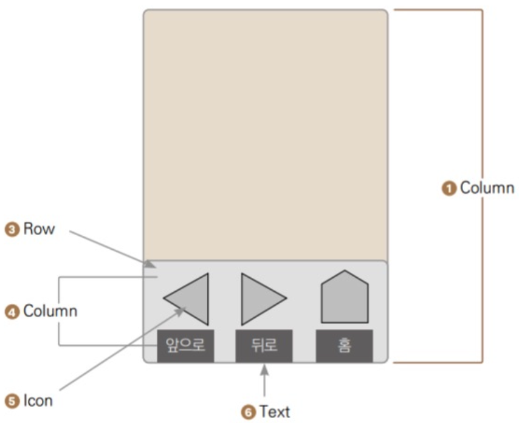
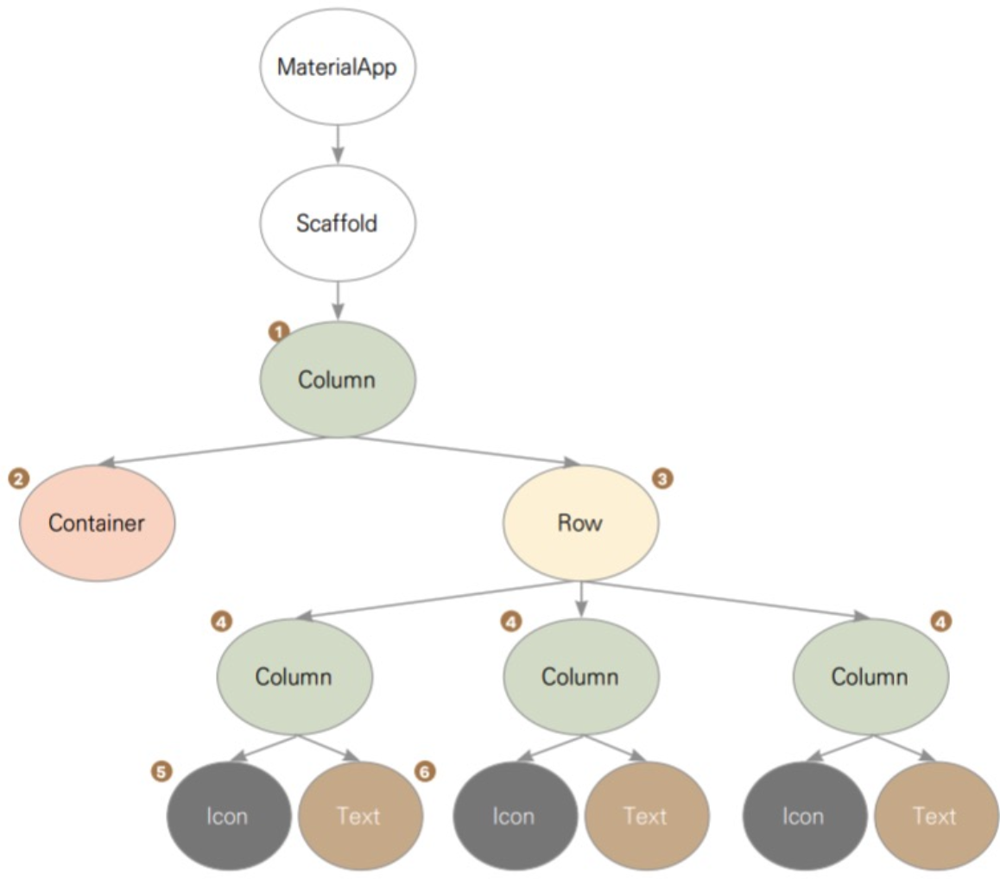
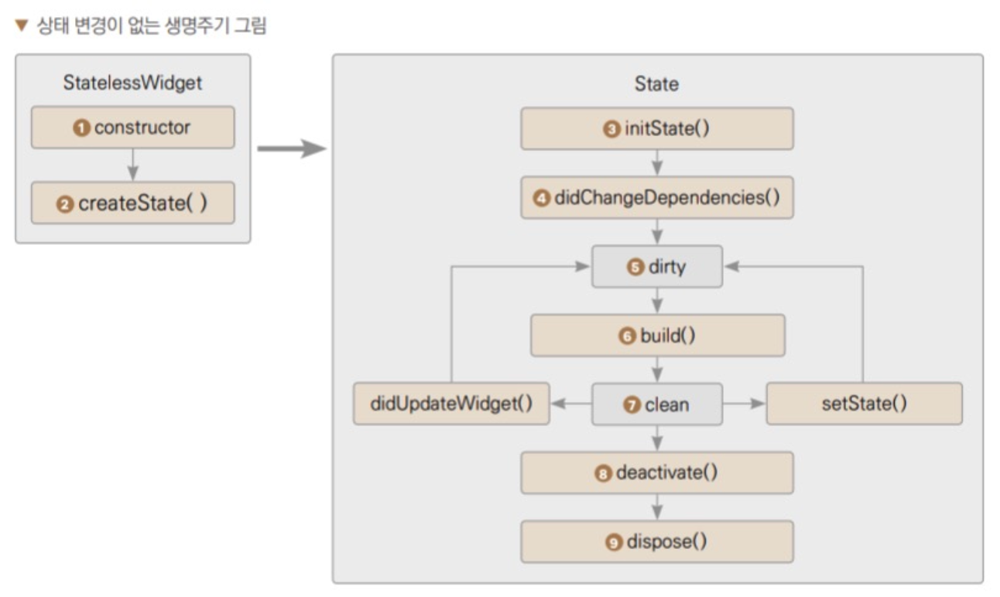
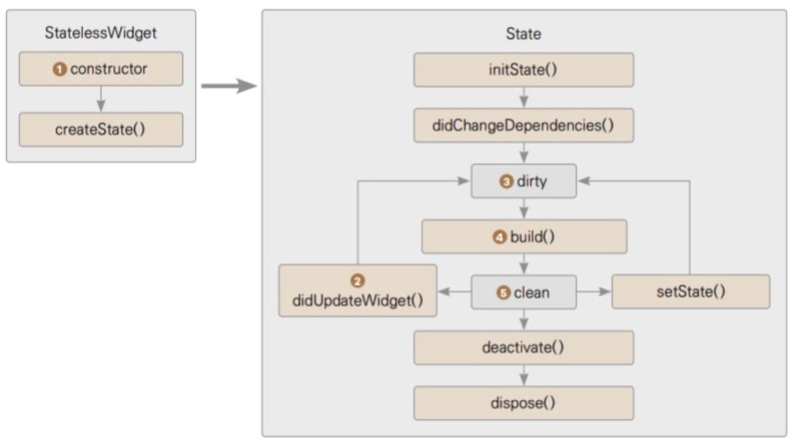

# widget
위젯은 자식을 하나만 갖는 위젯과 자식을 여럿 갖는 위젯으로 나뉜다. 자식을 하나만 갖는 대표적인 위젯은 아래와 같다. 대체로 child 매개변수를 입력받는다.
 
|위젯|설명|
|:---:|:---:|
|Container|자식을 담는 컨테이너 역할을 한다. 다만 단순하게 자식을 담는 역할만 하는게 아니라 배경색, 크기, 테두리 등의 디자인을 지정할 수 있다.|
|GestureDetector|플러터에서 제공하는 제스처 기능을 자식 위젯에서 인식하는 위젯이다. 텝, 드래그, 더블클릭 같은 제스처 기능이 자식 위젯에 인식됐을 때 함수를 실행할 수 있다.|
|SizedBox|높이와 넓이를 지정하는 위젯이다. Container 위젯과 다르게 디자인적 요소는 적용할 수 없고 const 생성자로 선언할 수 있어 퍼포먼스 측면에 더 효율적이다.|

다수의 자식을 입력할 수 있는 위젯은 children 매개변수를 입력 받고 리스트로 여러 위젯을 입력할 수 있으며 아래와 같다.
|위젯|설명|
|:---:|:---:|
|Column|children 매개변수에 입력된 모든 위젯들을 세로로 배치한다.|
|Row|children 매개변수에 입력된 모든 위젯들을 가로로 배치한다.|
|ListView|리스트를 구현할 때 사용하며 children 매개변수에 다수의 위젯을 입력할 수 있다. 입력된 위젯이 화면을 벗어나게 되면 스크롤이 가능해진다.|
## 위젯 생명주기 
위젯 생명주기는 위젯이 화면에 그려지는 순간부터 삭제되는 순간까지의 주기를 말한다. 
플러터에서는 UI를 표현할 때 사용되는 대표적인 위젯으로 StatelessWidget과 StatefulWidget이 있다.

#### 다음과 같은 UI를 구현한다면?

 
UI의 위젯 트리는 다음과 같다

### StatelessWidget
#### StatelessWidget의 생명주기
1. StatelessWidget이 빌드되고 생성자가 실행된다. 
2. 필수로 오버라이드 하는 build()함수가 실행된다. 
3. build() 함수에 반환한 위젯이 화면에 렌더링 된다. 

플러터에서 모든 클래스는 Widget 클래스를 상속하고 있고 Widget 클래스는 불변(immutable) 특성을 가지고 있다. 불변이란 클래스를 한 번 생성하면 속성을 변경할 수 없다는 뜻이다. 

#### StatelessWidget의 속성을 변경해야할 때
불변의 특성을 가진 StatelessWidget의 속성을 변경해야할 때가 있다. 한 예로 생성자에 새롱누 매개 변수가 입력되는 경우이다. build()에서 함수에서 매개변수 값을 사용하고 있다면 변경된 매개 변수를 기반으로 build()함수를 재실행해주면 된다. 하지만 StatelessWidget은 불변이기 때문에 한 번 생성된 인스턴스의 build()함수는 재실행되지 않는다. 대신에 인스턴스를 새로 생성한 후 기존 인스턴스를 대체해 변경사항을 화면에 반영한다. 

### StatefulWidget 
스테이트풀 위젯은 스테이트리스 위젯과 다른 목적으로 만들어졌으며 외부에서 위젯 생성자의 매개 변수를 변경해주면 위젯이 새롭게 생성되고 build()가 실행되기까지의 과정은 StatelessWidget과 같다. **하지만 위젯 내부에서 자체적으로 build()함수를 재실행해야할 때 StatefulWidget 함수를 사용한다.**

## 플러터의 3가지 생명주기
### 상태 변경이 없는 생명주기

1. StatefulWidget 생성자가 실행
2. CreateState() 함수기 실행되고 CreateState 함수는 필수로 오버라이드 해야하는 함수로, StatefulWidget과 연동되는 State를 생성 
3. State가 생성되면 initCreate()가 실행되는데 initState()는 State가 생성되는 순간에만 실행되며 절대로 다시 실행되지 않음
4. didChangeDependencies()가 실행디며 initState()와는 다르게 BuildContext가 제공되고 State가 의존하는 값이 변경되면 재실행됨
5. State의 상태가 dirty로 설정되며 dirty 상태는 build()가 재실행해야하는 상태라서 build()함수가 실행되고 UI가 반영
6. build() 실행이 완료되면 clean 상태로 변경되며 화면에 따로 변화가 없으면 이 상태를 유지
7. 위젯이 위젯 트리에서 사라지면 deactivate()가 실행 deactivate()는 State가 일시적으로 또는 영구적으로 삭제될 때 실행
8. dispose()가 실행되며 위젯이 영구적으로 삭제될 때 실행

### StatefulWidget 생성자의 매개 변수가 변경되었을 때 생명주기

1. Stateful Widget 생성자 실행
2. State의 didUpdateWidget() 함수 실행
3. State가 dirty 상태로 변경
4. build() 실행
5. State의 상태가 clean으로 변경

### State 자체적으로 build()를 자체적으로 재실행할 때 생명주기 
StatelessWidget은 생성될 때 build() 함수가 한 번 실행되고 절대로 다시 실행되지 않는다. **반면 StatefulWidge은 StatefulWidget 클래스와 State 클래스로 구성되어 있는데 State 클래스는 setState()함수를 실행해 build()를 자체적으로 재실행할 수 있다.**

1. setState()를 재실행
2. State가 dirty 상태로 변경
3. build()가 실행
4. State상태가 clean으로 변경

