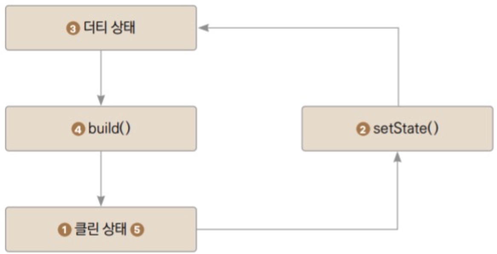

# setState()함수

## setState()함수 실행과정

1. Stateful 렌더링이 끝나고 클린상태로 플러터에서는 어떤 상태 변경 툴을 사용하든 클린 상태에서 상태를 변경해줘야 한다. 
2. setState()를 실행해서 원하는 속성들을 변경한다. 
3. 속성이 변경되고 위젯의 상태가 더티로 설정된다. 
4. build()함수가 재실행되며 state가 클린상태로 되돌아간다.

중요한 점은 **콜백함수가 비동기로 작성되면 안된다는 점**이다. 

