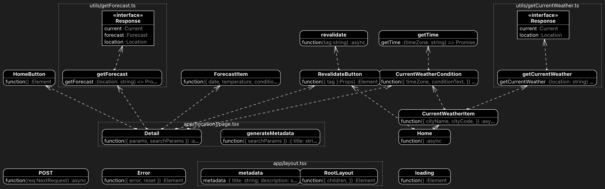

## Getting Started

```
npm run dev
# or
yarn dev
# or
pnpm dev
# or
bun dev
```
## 일주일 날씨

### 사용스택
- next.js
- mui

### 폴더 구조 
✅는 클라이언트 컴포넌트 입니다.
```
src
 ┣ app
 ┃ ┣ [location] : 다이나믹 라우팅
 ┃ ┃ ┗ page.tsx
 ┃ ┣ api
 ┃ ┃ ┗ revalidate
 ┃ ┃ ┃ ┗ route.ts
 ┃ ┣ error.tsx
 ┃ ┣ favicon.ico
 ┃ ┣ layout.tsx
 ┃ ┣ loading.tsx
 ┃ ┗ page.tsx : 최상단 페이지 
 ┣ components
 ┃ ┣ CurrentWeatherCondition.tsx 
 ┃ ┣ CurrentWeatherItem.tsx : ✅
 ┃ ┣ ForecastItem.tsx : ✅
 ┃ ┣ HomeButton.tsx : ✅
 ┃ ┗ RevalidateButton.tsx : ✅
 ┗ utils
 ┃ ┣ getCurrentWeather.ts
 ┃ ┣ getForecast.ts
 ┃ ┣ getTime.ts
 ┃ ┗ revalidate.ts
```

 ## 다이어그램
 